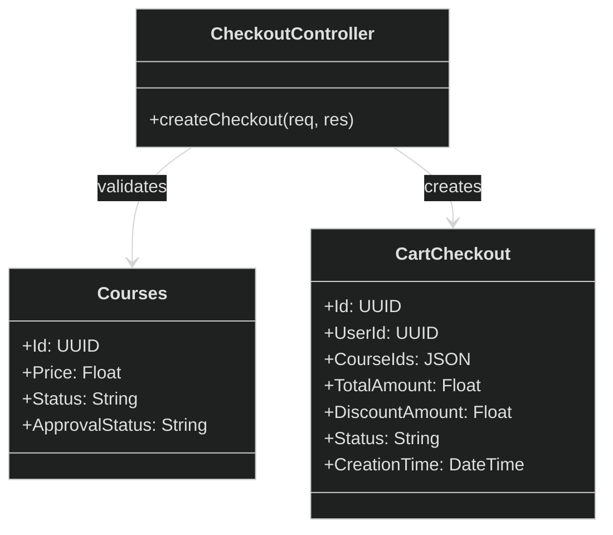
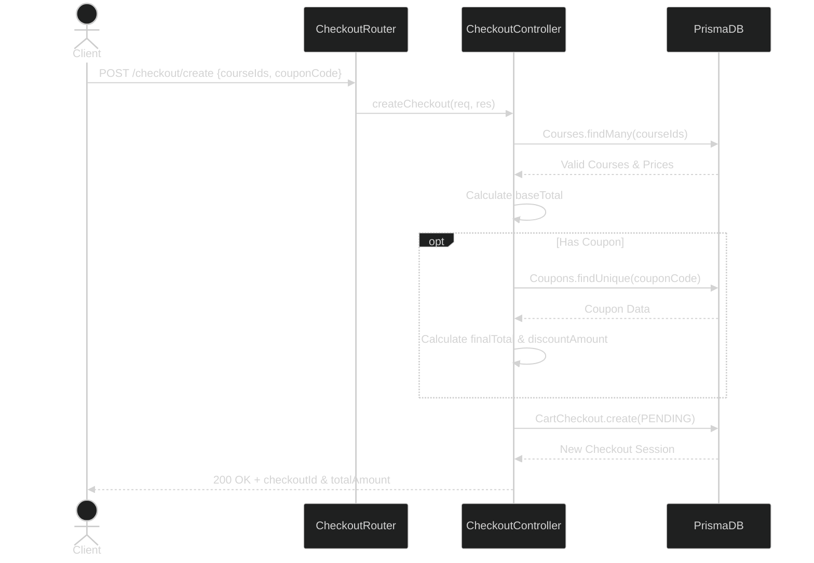
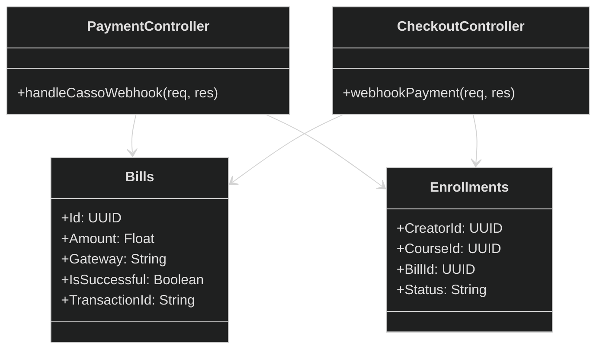
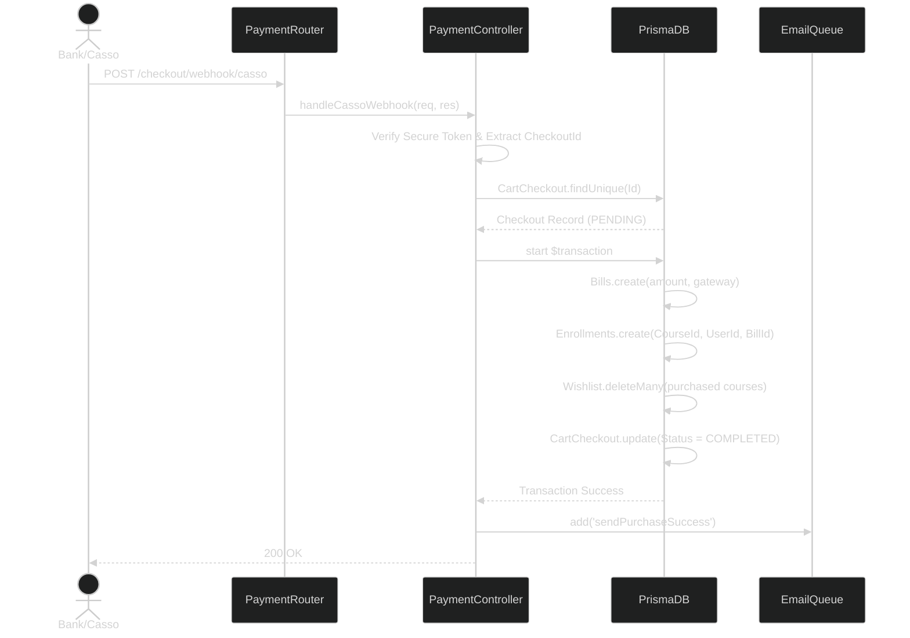
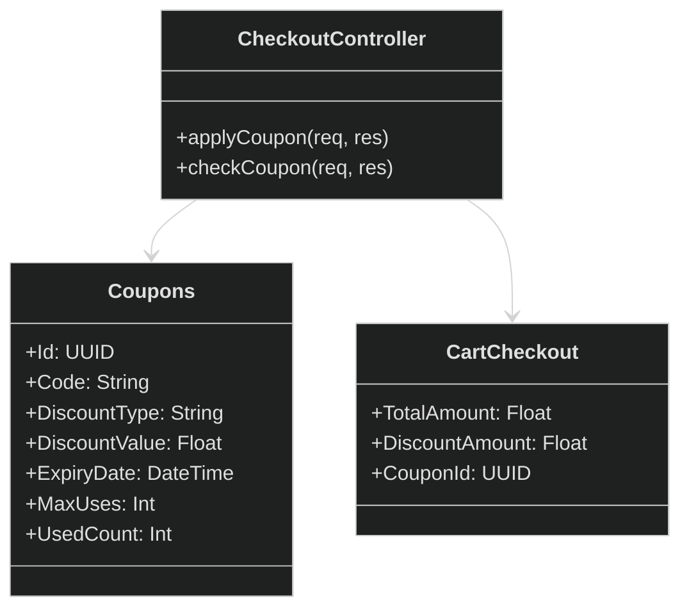
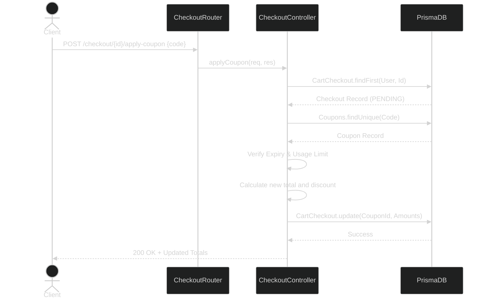
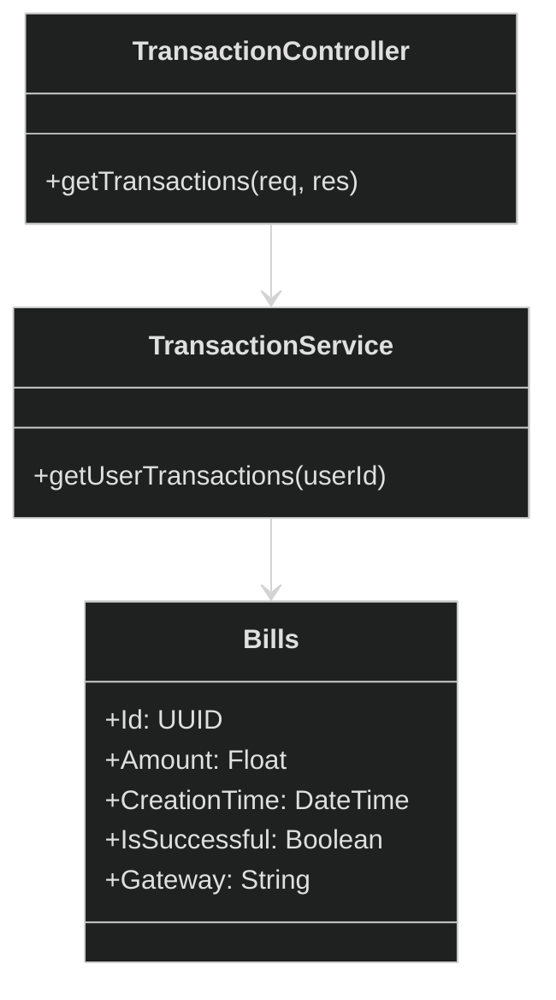
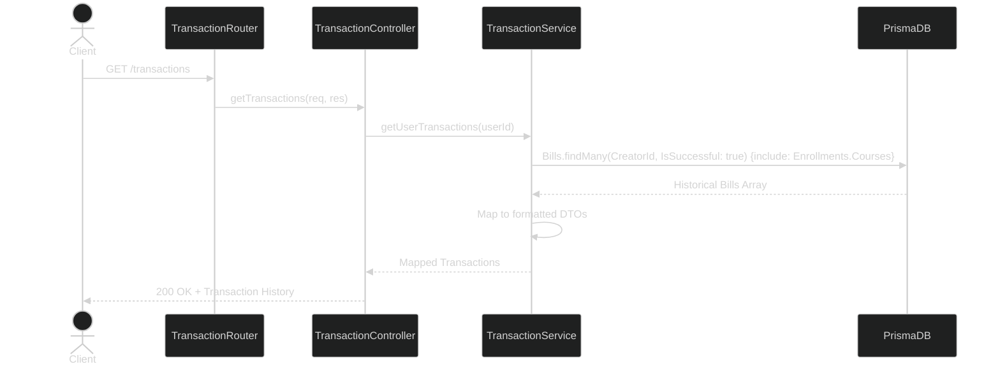
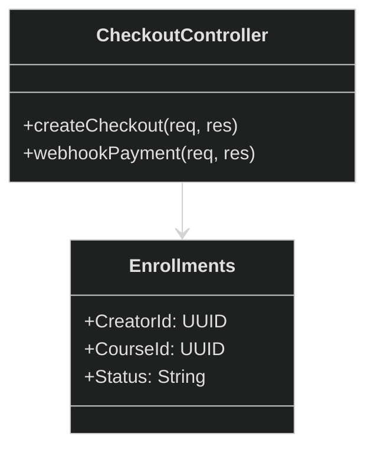
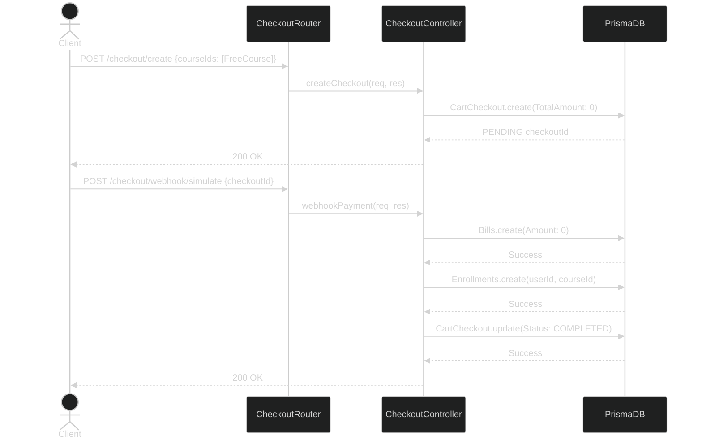

## II. Code Designs
### 4. Feature: Enrollment & Payment
*This part provides the detailed design for the Enrollment and Payment functions, separated down into each sub-feature.*

---

#### 4.1. Add Course to Cart (Create Checkout Session)
*This function initializes a checkout session for selected courses before proceeding to payment.*

**a. Class Diagram**


**b. Class Specifications**
| Class | Method | Description |
|---|---|---|
| `CheckoutController` | `createCheckout` | Receives a list of `courseIds`, validates that the courses exist and are 'APPROVED'/'Ongoing', calculates the total price, applies any provided coupon, and creates a new `CartCheckout` record with status `PENDING`. |

**c. Sequence Diagram**


**d. Prisma ORM Queries**
```javascript
// Validate courses
const courses = await prisma.courses.findMany({
    where: {
        Id: { in: courseIds },
        Status: 'Ongoing',
        ApprovalStatus: 'APPROVED'
    },
    select: { Id: true, Price: true }
});

// Create checkout session
const checkout = await prisma.cartCheckout.create({
    data: {
        UserId: userId,
        CourseIds: JSON.stringify(courseIds),
        TotalAmount: Math.round(finalTotal), 
        DiscountAmount: Math.round(discountAmount),
        CouponId: appliedCouponId,
        PaymentMethod: 'VietQR',
        Status: 'PENDING',
        CreationTime: new Date()
    }
});
```

---

#### 4.2. Purchase Course
*This function handles the actual payment confirmation via Casso webhook or a simulator, creating the final billing and enrollment records.*

**a. Class Diagram**


**b. Class Specifications**
| Class | Method | Description |
|---|---|---|
| `PaymentController` | `handleCassoWebhook` | Securely receives Casso banking callbacks, extracts the `checkoutId` and amount from the description, verifies payment totals, and executes a database transaction to finalize the purchase. |
| `CheckoutController` | `webhookPayment` | A mock/simulated webhook controller that manually completes a checkout session, creating a `Bill` and granting course `Enrollments`. |

**c. Sequence Diagram**


**d. Prisma ORM Queries**
```javascript
// Example inside the Prisma $transaction block
const bill = await tx.bills.create({
    data: {
        Action: 'Payment',
        Amount: amount, 
        Gateway: 'VietQR (Casso)',
        IsSuccessful: true,
        CreatorId: checkout.UserId,
        TransactionId: transaction.tid, 
    }
});

await Promise.all(courseIds.map(courseId => 
    tx.enrollments.upsert({
        where: {
            CreatorId_CourseId: { CreatorId: checkout.UserId, CourseId: courseId }
        },
        update: { Status: 'Active', BillId: bill.Id },
        create: {
            CreatorId: checkout.UserId,
            CourseId: courseId,
            BillId: bill.Id,
            Status: 'Active'
        }
    })
));

await tx.cartCheckout.update({
    where: { Id: checkoutId },
    data: { Status: 'COMPLETED', ProcessedTime: new Date() }
});
```

---

#### 4.3. Apply Coupon
*This function validates and attaches a discount coupon to an active checkout session.*

**a. Class Diagram**


**b. Class Specifications**
| Class | Method | Description |
|---|---|---|
| `CheckoutController` | `applyCoupon` | Validates a coupon code's expiration, active status, and usage limits against the selected courses. If valid, calculates the new discounted total and updates the `CartCheckout` record. |
| `CheckoutController` | `checkCoupon` | Purely checks if a coupon code is valid and returns the potential discount amount without saving state. |

**c. Sequence Diagram**


**d. Prisma ORM Queries**
```javascript
// Check Coupon validity
const coupon = await prisma.coupons.findUnique({ where: { Code: code } });
// Throw error if expired, inactive, or used up...

// Apply to Checkout
const updateResult = await prisma.cartCheckout.updateMany({
    where: { 
        Id: checkoutId,
        UserId: userId 
    },
    data: {
        CouponId: coupon.Id,
        DiscountAmount: Math.round(discountAmount),
        TotalAmount: Math.round(newTotal) 
    }
});
```

---

#### 4.4. View Transaction History
*Provides the user with a historical view of their payments and purchased courses.*

**a. Class Diagram**


**b. Class Specifications**
| Class | Method | Description |
|---|---|---|
| `TransactionController` | `getTransactions` | Extracts the `userId` from the authenticated request and calls the `TransactionService`. |
| `TransactionService` | `getUserTransactions` | Queries the `Bills` database table for successful transactions owned by the user, eager-loading enrolled courses to display historical receipt details. |

**c. Sequence Diagram**


**d. Prisma ORM Queries**
```javascript
const transactions = await prisma.bills.findMany({
    where: {
        CreatorId: userId,
        IsSuccessful: true
    },
    include: {
        Enrollments: {
            include: {
                Courses: {
                    select: { Id: true, Title: true, ThumbUrl: true, Price: true }
                }
            }
        }
    },
    orderBy: { CreationTime: 'desc' }
});
```

---

#### 4.5. Enroll Free Course
*A specialized flow bypassing external payment providers when the course price or final total equals zero.*

**a. Class Diagram**


**b. Class Specifications**
| Class | Method | Description |
|---|---|---|
| `CheckoutController` | `createCheckout` | Generates a checkout session. If the target course is free, the calculated `TotalAmount` becomes 0. |
| `CheckoutController` | `webhookPayment` | Serves as the immediate auto-completion trigger on the frontend for orders where the total is 0. Generates the `Bill` and `Enrollment` instantly without waiting for Casso. |

**c. Sequence Diagram**


**d. Prisma ORM Queries**
```javascript
// Inside createCheckout (Amount is automatically 0)
const checkout = await prisma.cartCheckout.create({
    data: {
        TotalAmount: 0, 
        Status: 'PENDING',
        // ...other relationships
    }
});

// Inside webhookPayment (Bypasses Bank)
const bill = await prisma.bills.create({
    data: {
        Amount: 0,
        Gateway: 'VietQR', // Simulated
        IsSuccessful: true,
        // ...other relationships
    }
});

await prisma.enrollments.create({
    data: {
        CreatorId: userId,
        CourseId: courseId,
        BillId: bill.Id,
        Status: 'Active'
    }
});
```
