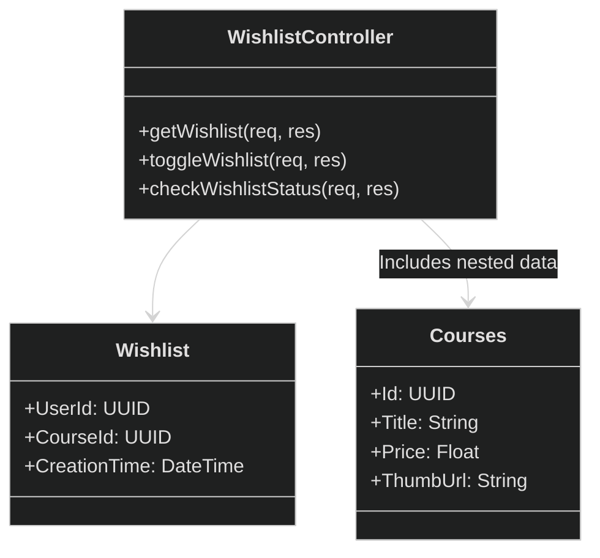
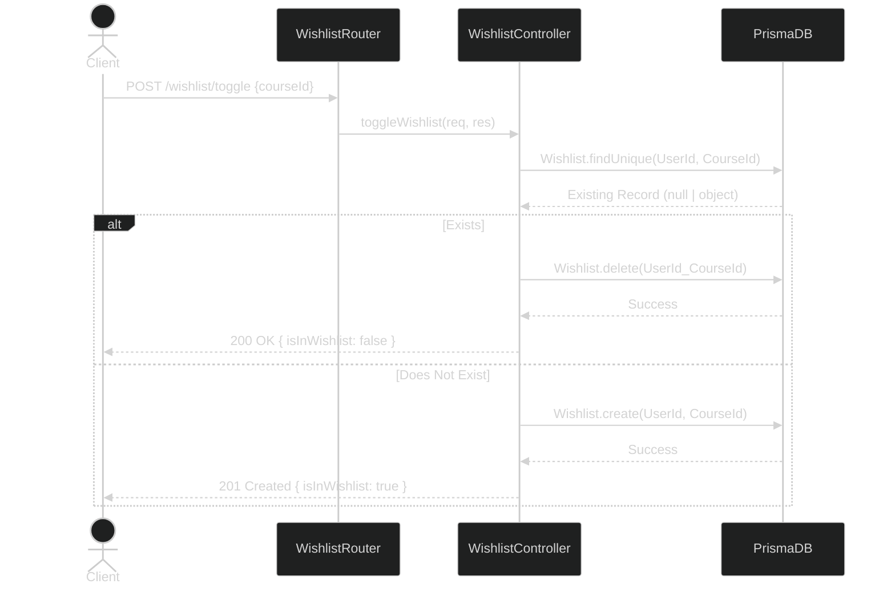
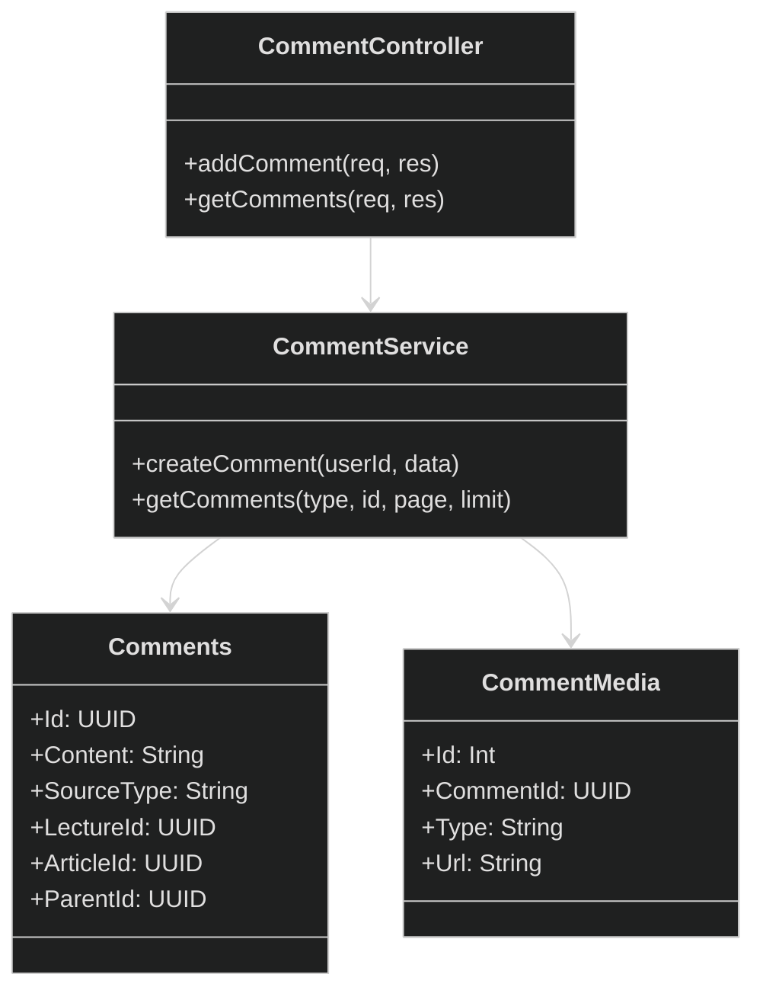
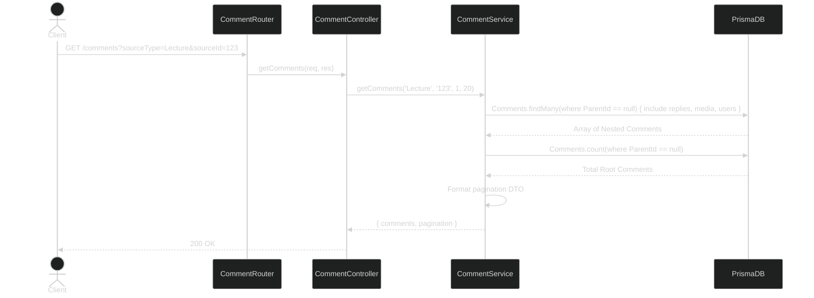
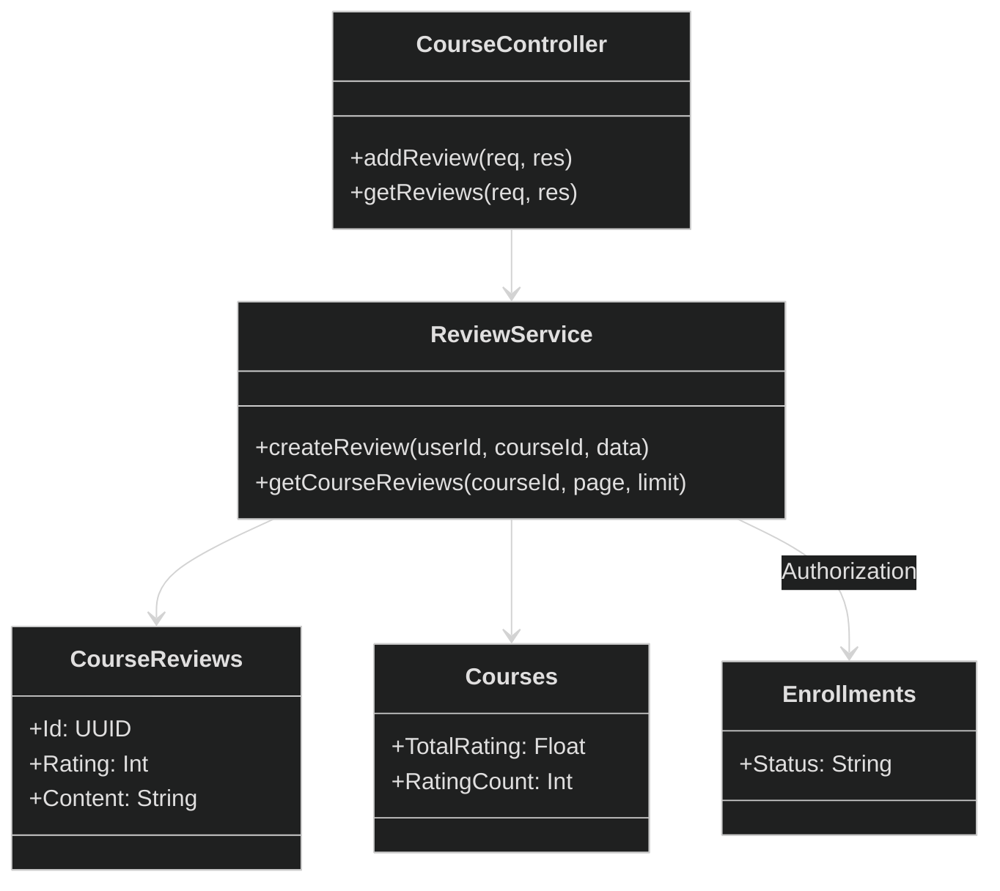
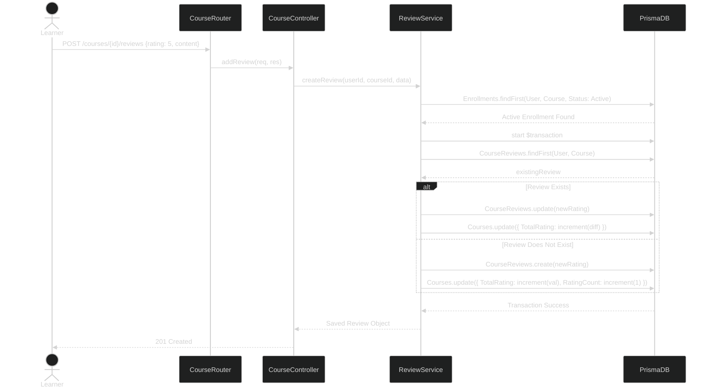

## II. Code Designs
### 5. Feature: User Engagement (Wishlist, Comments, Ratings & Reviews)
*This part provides the detailed design for the User Engagement functions, including managing the wishlist, participating in lesson discussions, and rating courses.*

---

#### 5.1. WishList (Add / Remove / View)
*This function allows learners to save courses for future reference and manage their saved list.*

**a. Class Diagram**


**b. Class Specifications**
| Class | Method | Description |
|---|---|---|
| `WishlistController` | `getWishlist` | Retrieves a list of all courses the currently authenticated user has added to their wishlist, eager-loading basic course details. |
| `WishlistController` | `toggleWishlist` | Checks if a specific course is already in the user's wishlist; if so, it removes it, otherwise it adds it. Returns the new boolean status. |
| `WishlistController` | `checkWishlistStatus` | Checks whether a specific course is currently in the authenticated user's wishlist. Returns a boolean status. |

**c. Sequence Diagram**


**d. Prisma ORM Queries**
```javascript
// Toggle Wishlist Logic
const existing = await prisma.wishlist.findUnique({
    where: { UserId_CourseId: { UserId: userId, CourseId: courseId } }
});

if (existing) {
    await prisma.wishlist.delete({
        where: { UserId_CourseId: { UserId: userId, CourseId: courseId } }
    });
} else {
    await prisma.wishlist.create({
        data: { UserId: userId, CourseId: courseId }
    });
}

// Get Wishlist
const wishlist = await prisma.wishlist.findMany({
    where: { UserId: userId },
    include: {
        Courses: {
            include: { Instructors: { /*...*/ }, Categories: { /*...*/ } }
        }
    },
    orderBy: { CreationTime: 'desc' }
});
```

---

#### 5.2. Comments & Discussions
*This function acts as a Q&A or discussion board attached to specific Lectures or Articles.*

**a. Class Diagram**


**b. Class Specifications**
| Class | Method | Description |
|---|---|---|
| `CommentController` | `addComment` | Validates payload constraints and passes content, source references, and optional media arrays to `CommentService`. |
| `CommentService` | `createComment` | Executes a Prisma `$transaction` to ensure `Comments` and its nested `CommentMedia` records are securely created together. Handles routing logic based on `sourceType` (Lecture/Article). |
| `CommentService` | `getComments` | Retrieves a paginated list of root-level comments along with their 1st-level child `replies` (using self-referencing relationship) and media attachments. |

**c. Sequence Diagram**


**d. Prisma ORM Queries**
```javascript
// Add Comment with Media Transaction
await prisma.$transaction(async (tx) => {
    const comment = await tx.comments.create({
        data: {
            Content: content,
            CreatorId: userId,
            SourceType: 'Lecture',
            LectureId: sourceId,
            ParentId: parentId || null
        }
    });

    if (media?.length > 0) {
        await tx.commentMedia.createMany({
            data: media.map(m => ({
                CommentId: comment.Id,
                Type: m.type,
                Url: m.url
            }))
        });
    }
    return comment;
});

// Get Nested Comments
const comments = await prisma.comments.findMany({
    where: { 
        LectureId: sourceId, 
        ParentId: null // Root level only
    },
    include: {
        Users: { select: { FullName: true, AvatarUrl: true } },
        CommentMedia: true,
        other_Comments: { // Replies relationship
            include: {
                Users: { select: { FullName: true, AvatarUrl: true } },
                CommentMedia: true
            },
            orderBy: { CreationTime: 'asc' }
        }
    },
    orderBy: { CreationTime: 'desc' },
    skip: 0,
    take: 20
});
```

---

#### 5.3. Course Reviews & Ratings
*This function allows students to rate a course and provide feedback, exclusively available to enrolled learners.*

**a. Class Diagram**


**b. Class Specifications**
| Class | Method | Description |
|---|---|---|
| `ReviewService` | `createReview` | Confirms the user holds an `Active` `Enrollment`. Checks for an existing review. If updating, incrementally adjusts the `Courses.TotalRating` aggregate. If new, increments `TotalRating` and `RatingCount`. Handled within a single database transaction. |
| `ReviewService` | `getCourseReviews` | Fetches a paginated, chronologically descending list of reviews attached to a specific course, populated with basic user demographic data. |

**c. Sequence Diagram**


**d. Prisma ORM Queries**
```javascript
// Enforcement of Enrollment Policy
const enrollment = await prisma.enrollments.findFirst({
    where: {
        CreatorId: userId,
        CourseId: courseId,
        Status: 'Active' 
    }
});
if (!enrollment) throw new Error('Unenrolled');

// Transaction block
await prisma.$transaction(async (tx) => {
    // Creating Brand New Review
    const review = await tx.courseReviews.create({
        data: {
            CourseId: courseId,
            CreatorId: userId,
            Rating: ratingInt,
            Content: content 
        }
    });

    // Automatically synchronize course aggregate fields
    await tx.courses.update({
        where: { Id: courseId },
        data: {
            TotalRating: { increment: ratingInt },
            RatingCount: { increment: 1 }
        }
    });
});
```
