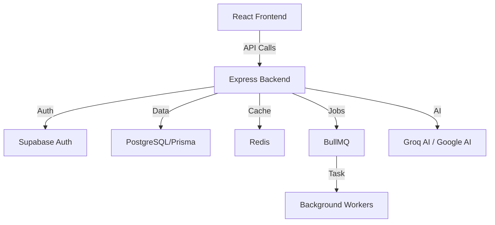

# System Architecture Documentation

## Overall System Architecture
FlyUp EduTech is built as a distributed system with a decoupled Frontend and Backend.

## Backend Architecture
The backend is a Node.js Express application utilizing modern ES Modules.
- **ORM:** Prisma interacts with a PostgreSQL database.
- **Caching:** Redis is used to cache frequent queries (e.g., course listings).
- **Queueing:** BullMQ handles asynchronous tasks like sending emails and scheduled status checks.
- **Documentation:** Swagger/OpenAPI for endpoint documentation.

## Frontend Architecture
The frontend is a Single Page Application (SPA) built with React 19 and Vite.
- **Routing:** React Router DOM manages navigation.
- **State:** Context API for global state; TanStack Query for server-side state.
- **UI:** Tailwind CSS + DaisyUI for a modern, responsive interface.
- **Animations:** Framer Motion for interactive transitions.

## Database Design
- **Core Entities:** `Users`, `Courses`, `Instructors`, `Enrollments`, `Bills` (Transactions).
- **Content Entities:** `Sections`, `Lectures`, `Comments`, `CourseReviews`.
- **Relationship:** Managed via Prisma relationships (1:N, N:M).
- *Refer to `DATABASE_README.md` for the detailed schema and Vietnamese documentation.*

## Authentication Flow
- **Standard:** JWT-based authentication for custom email/password login.
- **OAuth:** Integration with Google and GitHub via Supabase and custom controllers.
- **Security:** Tokens are managed securely; RLS (Row Level Security) is used via Supabase for direct data access where applicable.

## Payment & Checkout Flow
- **Process:** Cart -> Checkout -> Transaction -> Enrollment.
- **Validation:** Server-side verification of payment status before granting enrollment.
- *Refer to `CART_CHECKOUT_FLOW.md` for the detailed sequence and Vietnamese documentation.*

## AI Integration Architecture
- **Models:** Utilizes `llama-3.3-70b-versatile` via Groq SDK and Google Generative AI.
- **Functionality:**
  - Chatbot widget provides real-time course assistance and general platform info.
  - AI-powered course recommendations provide personalized learning paths.
- **Processing:** Requests are handled via `chatbotController` and `ai-course-recommendation-controller` which communicate with AI providers.

### AI Recommendation Service
- **Architecture:** AI-powered course recommendations via Groq LLM
- **Caching:** Redis with 1-hour TTL, hash-based cache keys
- **Fallback:** Rule-based recommendations if AI unavailable
- **Rate Limit:** 10 requests/minute per IP
- **Performance:** <500ms (cached), <3s (uncached)

**Flow:**
1. User requests recommendations
2. Check Redis cache (key: `recommendations:userId:enrollmentHash`)
3. If miss: fetch user profile, build AI context, call Groq API
4. Parse AI response, enrich with course data
5. Cache result for 1 hour
6. Return to user

**Files:**
- Service: `backend/src/services/ai/personalized-course-recommendation-service.js`
- Controller: `backend/src/controllers/ai-course-recommendation-controller.js`
- Router: `backend/src/routers/ai-course-recommendations-router.js`
- AI Client: `backend/src/utils/ai-providers/groq-client.js`
- Utilities: `backend/src/services/ai/ai-prompt-builder-utilities.js`

## Caching Strategy
- **Layer:** Redis acts as a high-performance cache.
- **Usage:** Stores course metadata, search results, and session data to reduce database load.

## Background Jobs
- **BullMQ:** Manages task queues.
- **Workers:** Dedicated worker processes (`src/workers/`) handle email dispatch and course status monitoring independently from the main request loop.

## Security Architecture
- **Rate Limiting:** Implemented on sensitive endpoints:
  - Login: Standard auth rate limits.
  - Chatbot: 10 req/min for standard, 5 req/min for streaming.
  - AI Recommendations: 10 req/min.
- **Validation:** Data sanitization and validation using `express-validator`.
- **Memory Safety:** Strict timeout management and timer cleanup in AI and Cache clients to prevent leaks.
- **Environment:** Secret management via `.env` files.
- **CORS:** Controlled access to the backend API.

---
*Last Updated: 2026-02-12*
